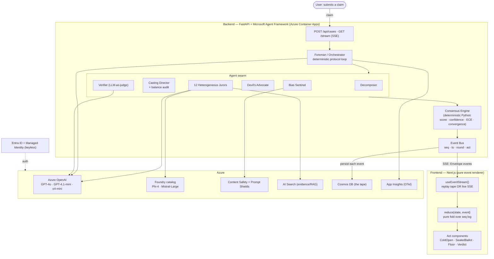

# Verdict

**A heterogeneous swarm of AI jurors that turns a contested claim into a fact‑grounded, multi‑perspective verdict — with a calibrated confidence score, preserved dissent, and live bias flags — engineered specifically to resist the groupthink that breaks naive multi‑agent debate.**

Verdict runs *12 Angry Agents*: twelve jurors on genuinely different models deliberate a claim across five acts — a blind independent vote, cross‑examination with live fact‑checking, a mandated devil's advocate, animated vote shifts, and a final calibrated verdict that **preserves the minority report instead of averaging it away**.

---

## The problem we're solving

Public discourse and "AI fact‑checkers" tend to hand you a single confident answer with no visible reasoning, no dissent, and no calibration. Naive multi‑agent setups don't fix this — they make it worse:

- **Anchoring is the dominant failure mode of LLM debate.** When prior work instantiated *12 Angry Men* as LLMs, **17 of 18 runs ended in a hung jury** and the film's core event — a lone dissenter shifting the room — almost never happened. Identical models share identical priors, so "twelve agents" behave like one.
- **The advertised mechanisms are usually theater.** "Confidence," "consensus," "bias detection," and "dissent preservation" exist only as words inside a prompt — nothing is measured, nothing is grounded, nothing is calibrated.
- **Single answers hide the disagreement that matters.** A 55/45 split and a 95/5 split should not look the same, and a well‑argued minority view should survive to the verdict.

**Verdict treats anti‑anchoring as a first‑class architectural requirement, not a prompt nicety:**

| Failure mode | Verdict's countermeasure |
|---|---|
| Shared priors → groupthink | **Heterogeneous panel** — each juror runs a *different* Azure model (GPT‑4o, GPT‑4.1‑mini, o4‑mini, Phi‑4, Mistral‑Large) |
| Early conformity / anchoring | **Blind round 1** — jurors vote independently before seeing anyone else |
| Ungrounded assertion | **Shared, citable evidence base** + an **LLM‑as‑judge Verifier** scoring every claim against it |
| Premature consensus | **Mandated Devil's Advocate** must attack the emerging consensus every round |
| "Confidence" as a vibe | **Deterministic Consensus Engine** (pure Python) computes score, calibration (ECE), convergence, and vote‑deltas in code |
| Dissent erased by averaging | **Minority Report** is a first‑class output, rendered and preserved |
| Manipulative framing | **Bias & Sensationalism Sentinel** (Azure AI Content Safety + Prompt Shields) flags loaded language live |

The output is a verdict you can interrogate: a calibrated confidence, a per‑sub‑claim breakdown with citations, a preserved minority report, bias flags, and a replayable "tape" of exactly how the room got there.

---

## How it works — the five acts

The UI is a broadcast‑style panel show; the engine is a serious deliberation protocol. Each act is driven entirely by a stream of events.

| Act | What happens | What it proves |
|---|---|---|
| **Cold Open — The Docket** | Claim is decomposed into atomic sub‑claims; the Casting Director seats 12 topic‑relevant, **provably balanced** jurors | Relevant + balanced *by construction*, not by hope |
| **Act 1 — Sealed Ballot** | Jurors vote **blind** (frosted booths), then a poll‑style reveal | Anti‑anchoring: independent priors before any influence |
| **Act 2 — The Floor** | Cross‑examination: jurors make checkable claims → live fact‑check → bias flags → the devil's advocate "heel" attacks | Grounded reasoning + mandated dissent |
| **Act 3 — The Turn** | Animated vote shifts, the turning point, the swinging consensus meter | *Who* changed their mind and *why* — the dramatic + measurable payload |
| **Act 4 — The Verdict** | Calibrated confidence, per‑sub‑claim verdict, **preserved Minority Report**, you‑vs‑the‑room | "Calibrated, not a vibe" — honest by construction |

---

## Tech stack

**Microsoft‑native, keyless throughout** (`DefaultAzureCredential` — no secrets in source).

| Layer | Technology | Role |
|---|---|---|
| Orchestration | **Microsoft Agent Framework** (`agent-framework` 1.8) | The agent swarm; deterministic Foreman protocol loop |
| Reasoning / inference | **Azure OpenAI** — GPT‑4o, GPT‑4.1‑mini, **o4‑mini** (reasoning) | Foreman, Decomposer, jurors, Verifier |
| Heterogeneous jurors | **Azure AI Foundry catalog** — **Phi‑4**, **Mistral‑Large‑3** (via Azure AI Inference) | The anti‑anchoring lever — uncorrelated priors |
| Safety | **Azure AI Content Safety + Prompt Shields** | Bias Sentinel + inbound prompt‑injection screening |
| Evidence (RAG) | **Azure AI Search** (basic) | Shared, citable evidence base *(seeded today; Bing/AI Search RAG next)* |
| State / "the tape" | **Azure Cosmos DB** (serverless) | Threads, transcripts, vote ledger, replayable event log |
| Secrets | **Azure Key Vault** (RBAC) | Keyless secret store |
| Observability | **App Insights + Log Analytics** | OpenTelemetry traces of the swarm |
| Identity | **Microsoft Entra ID + Managed Identity** | Keyless auth; no keys in the repo |
| Backend API | **FastAPI + SSE** (`sse-starlette`) | Streams the live deliberation to the UI |
| Frontend | **Next.js 14 + React 18** (TypeScript, CSS‑only motion) | Pure renderer of the event stream |
| IaC / deploy | **Bicep + `azd`**, **GitHub Actions** (keyless OIDC) | Provision + CI/CD on every push |

---

## Architecture

The whole system is **a directed event stream**: a deterministic workflow with an LLM‑driven orchestrator inside it. The engine emits events; the UI never computes a score — every number is taken verbatim from an event.



### The one idea: the UI is a pure renderer of an event stream

```
claim ─► Foreman ─► swarm ─► Consensus Engine ─► Event Bus ──► Cosmos (durable tape)
                                                      │
                                                      └─ SSE ─► useEventStream() ─► reduce() ─► UI
```

- **`seq` is the spine.** Events are ordered/deduped/scrubbed by a monotonic `seq`; reconnects replay the gap (`Last-Event-ID`). The same reducer renders **live SSE and cached replay identically** — so the demo looks exactly like production.
- **Everything `vote.*` / `consensus.*` is engine‑computed.** The deterministic [Consensus Engine](backend/consensus.py) is the only place scores are produced; the UI just displays them. That's what keeps "calibrated, not a vibe" honest.
- **Round structure is deterministic; only intra‑round reasoning is LLM‑driven** — reproducible demos, with the open‑ended thinking confined to the agents.

The engine ↔ UI contract is one file on each side: [`lib/events.ts`](lib/events.ts) (TypeScript) mirrors the backend's emitted [`Envelope`](backend/events.py).

---

## Repository layout

```
backend/                 # Microsoft Agent Framework swarm (Python)
  orchestrator.py        # the Foreman — deterministic deliberation protocol
  agents.py              # Decomposer, Juror, Devil's Advocate, Verifier, Bias Sentinel
  casting.py             # 12 fixed slots (model+disposition) → balanced topical panel
  consensus.py           # DETERMINISTIC engine: score, label, confidence, ECE, turning points
  models.py              # keyless heterogeneous model layer (OpenAI + Foundry inference)
  events.py / cosmos_store.py   # event bus (SSE fan-out) + Cosmos persistence (the tape)
  server.py              # FastAPI: POST /api/cases, GET /api/cases/{id}/stream (SSE)
  run_local.py / validate_tape.py / tests/   # local runner, schema validator, unit tests
lib/                     # frontend transport + the event contract + reducer
  events.ts  reducer.ts  useEventStream.ts
components/              # pure presentational act renderers (FloorScreen, JuryBox, …)
public/case_*_tape.json # canned replay fixtures (also the seeded evidence base)
infra/                   # Bicep (azd) — the keyless Azure footprint
.github/workflows/       # ci.yml (build/test) + azure-dev.yml (azd deploy via OIDC)
BACKEND_SETUP.md         # how the Azure footprint is provisioned
```

---

## Run it

### Frontend (canned replay — zero backend)

```bash
npm install
npm run dev        # http://localhost:3000  → pick a "▶ Replay" case
```

Use the transport bar to **Play / Pause / Step / Restart**, change **speed**, **scrub** the timeline, and switch cases.

### Backend (live swarm)

Provision Azure once (see [BACKEND_SETUP.md](BACKEND_SETUP.md)), then:

```bash
python3.11 -m venv .venv && source .venv/bin/activate
pip install -r backend/requirements.txt
azd env get-values > backend/.env          # keyless endpoints, no secrets

# one deliberation end-to-end, dumped as a tape:
python backend/run_local.py --case C --panel 12 --rounds 3

# or serve it live over SSE:
uvicorn server:app --port 8000             # run from backend/
```

### Frontend ↔ live backend

With the backend on `:8000`, start the UI and pick a **🔴 Live** case — `useEventStream` POSTs `/api/cases`, then tails `/api/cases/{id}/stream` through the same reducer. Override the API base with `NEXT_PUBLIC_API_BASE`.

### Tests

```bash
npm run typecheck && npm run build           # frontend
python -m pytest backend/tests -q            # deterministic Consensus Engine
python backend/validate_tape.py backend/out/<case>.json   # tape ↔ schema contract
```

---

## Deploy & CI/CD

- **Infra**: `azd up` provisions everything in [`infra/`](infra) (AI Services + 5 model deployments, Content Safety, AI Search, Cosmos, Key Vault, App Insights, Managed Identity + RBAC).
- **CI/CD**: GitHub Actions, **keyless via OIDC federated identity** (no stored secrets).
  - `ci.yml` — builds the frontend and unit‑tests the Consensus Engine on every push/PR.
  - `azure-dev.yml` — runs `azd provision`/`deploy` on push to `main`.

---

## Status & roadmap

**Working today:** full provisioning, the live 12‑juror swarm (keyless, all 21 event types, persisted to Cosmos), SSE streaming, frontend live + replay, CI/CD.

**Next:** deploy backend + web as Azure Container Apps services (uncomment `services:` in [`azure.yaml`](azure.yaml)); real evidence grounding (Grounding with Bing + AI Search RAG); a Foundry‑Evaluations harness for accuracy/ECE/anchoring metrics in CI; optional Teams (Copilot Studio) trigger surface.
